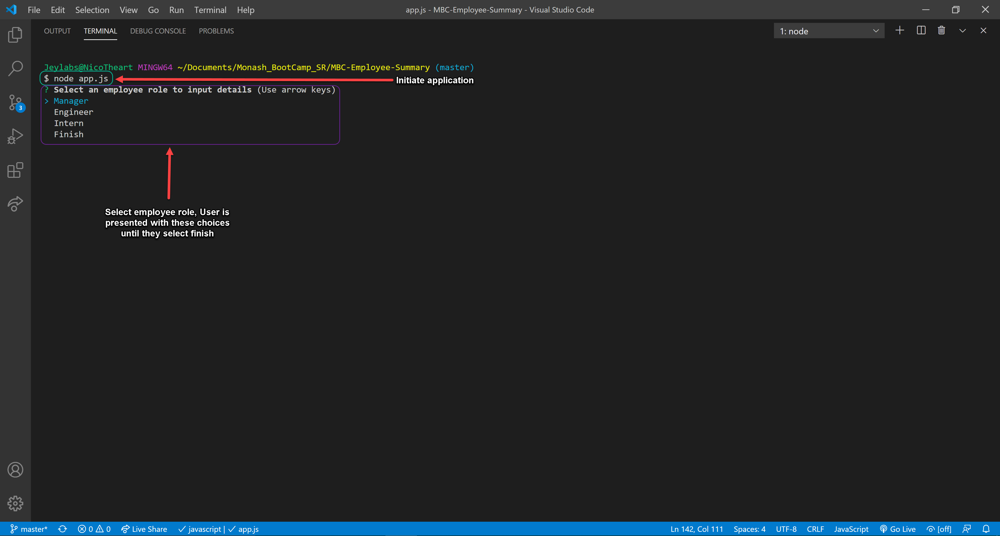
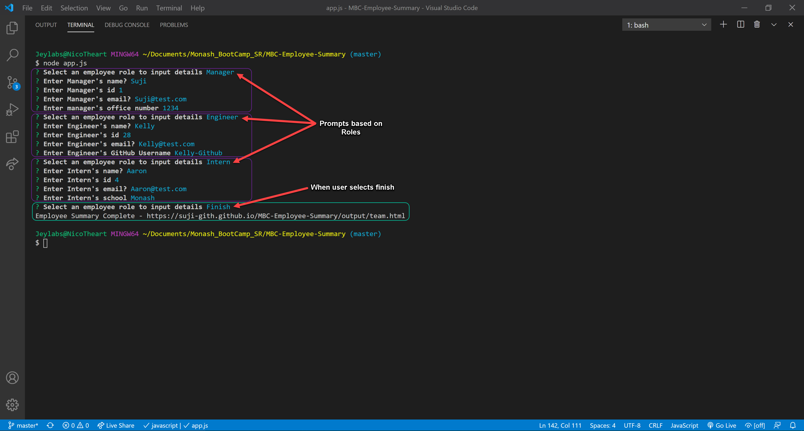
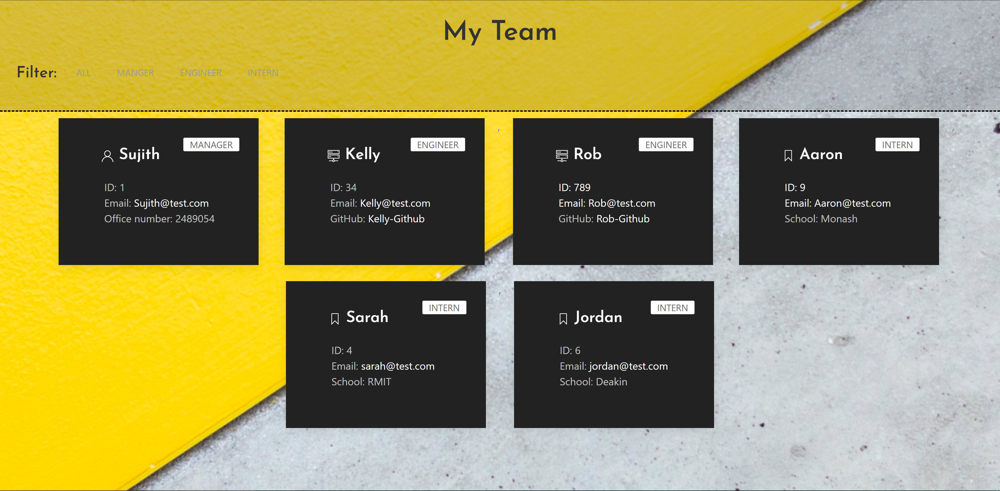

# MBC-Employee-Summary

## Application & Repository Link

###### [Application Walkthrough](https://drive.google.com/file/d/1p4LqZLVq4nolA9hq-2H6RBQQBxPESh3X/view?usp=sharing)

###### [Repository Link](https://github.com/Suji-GitH/MBC-Employee-Summary)

## Content
- [Overview](#Overview)
- [Acceptance Criteria](#Acceptance-Criteria)
- [Application Screens](#Application-Screens)
- [Credits](#Credits)
- [Testing](#Testing)

## Overview

```
As a manager
I want to generate a webpage that displays my team's basic info
so that I have quick access to emails and GitHub profiles
```

## Acceptance Criteria

* Your app will run as a Node CLI to gather information about each employee.

* Prompt the user for their email, id, and specific information based on their role with the company. For instance, an intern may provide their school, whereas an engineer may provide their GitHub username.

## Application-Screens

###### App Screenshots

Initiate Application


Employee Prompts


Output html


## Credits

- npm inquirer 
- npm jest
- node.js
- UIkit

## Testing 

This application is tested by TDD methodology. This link below will guide you to test cases written using npm jest format.  

###### [Test Cases](https://github.com/Suji-GitH/MBC-Employee-Summary/tree/master/test)


